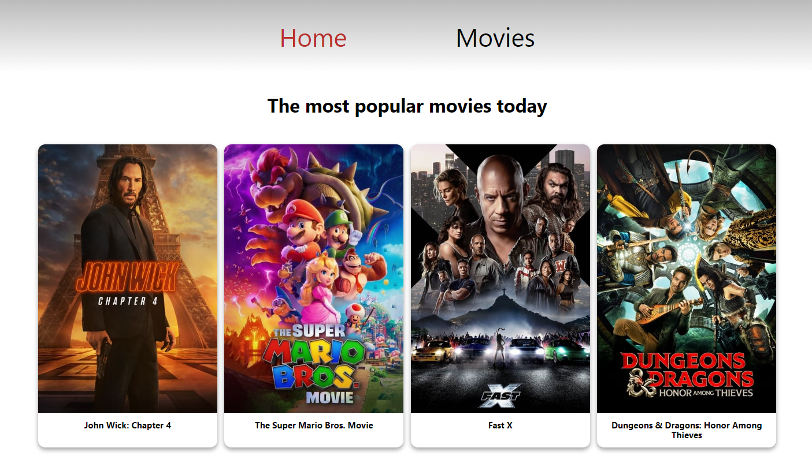
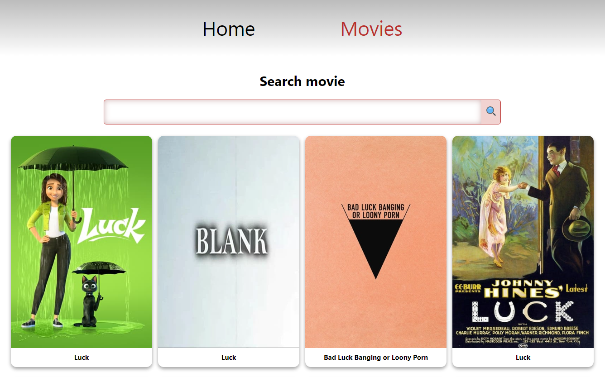
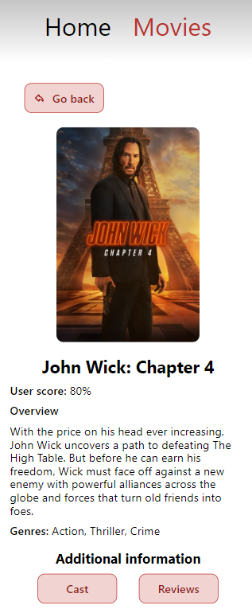

# Маршрутизація

Створено базову маршрутизацію для застосунку пошуку і зберігання фільмів.

Для бекенду використовувався themoviedb.org API.

## Code Splitting (поділ коду)

Додано асинхронне завантаження JS-коду для маршрутів застосунку, використовуючи React.lazy() і Suspense.

